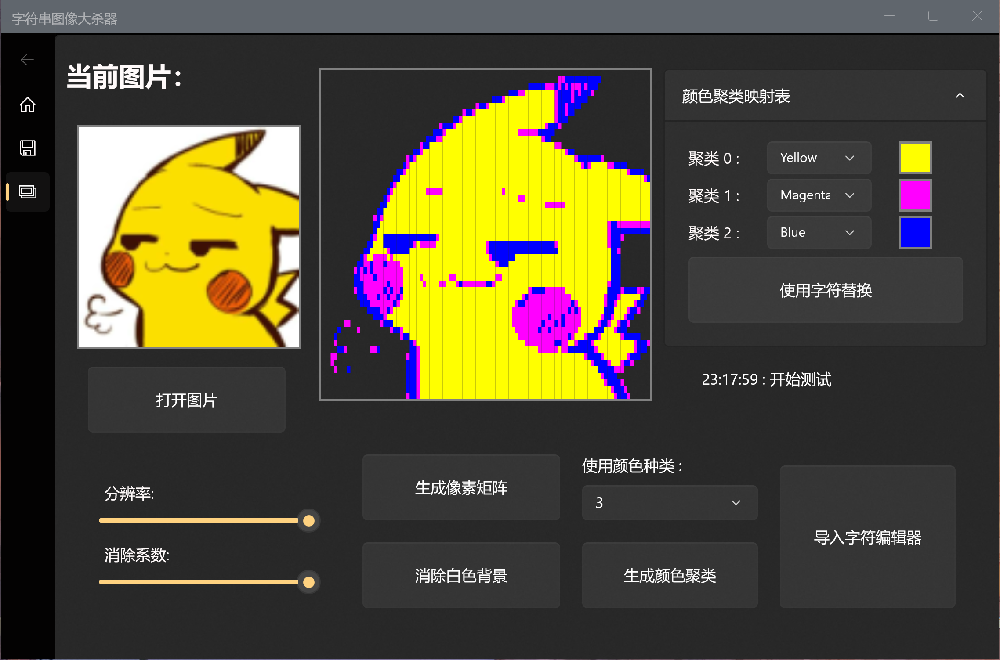
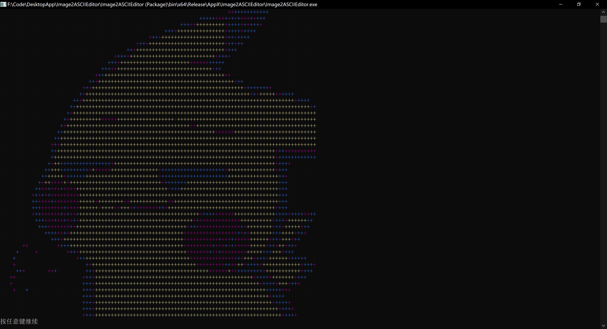
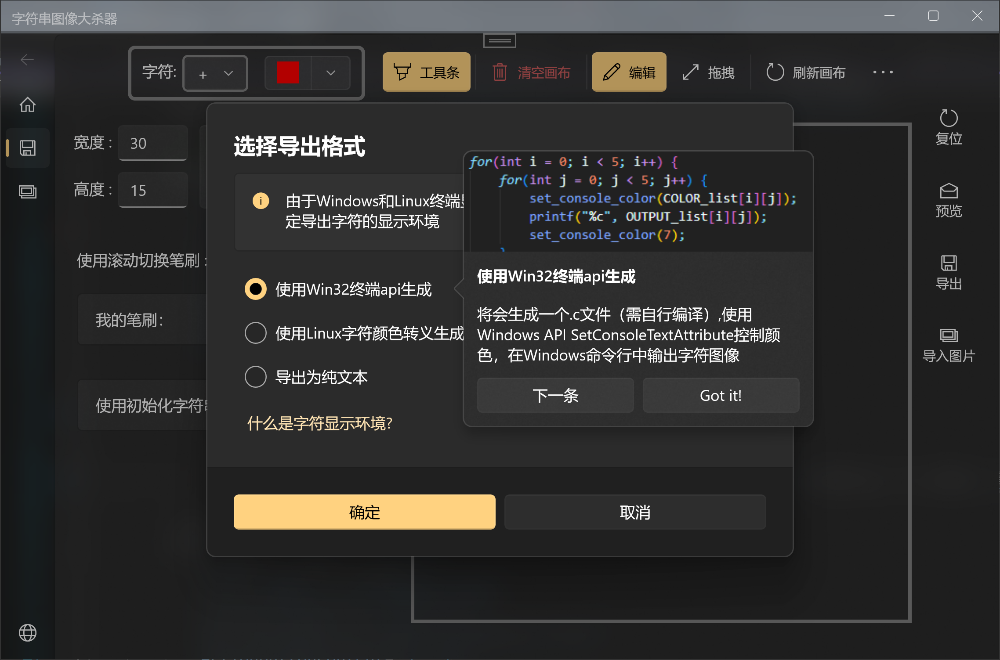
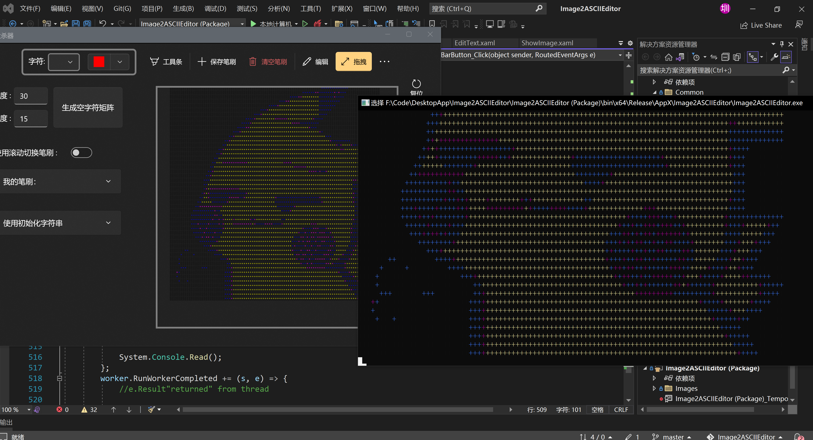
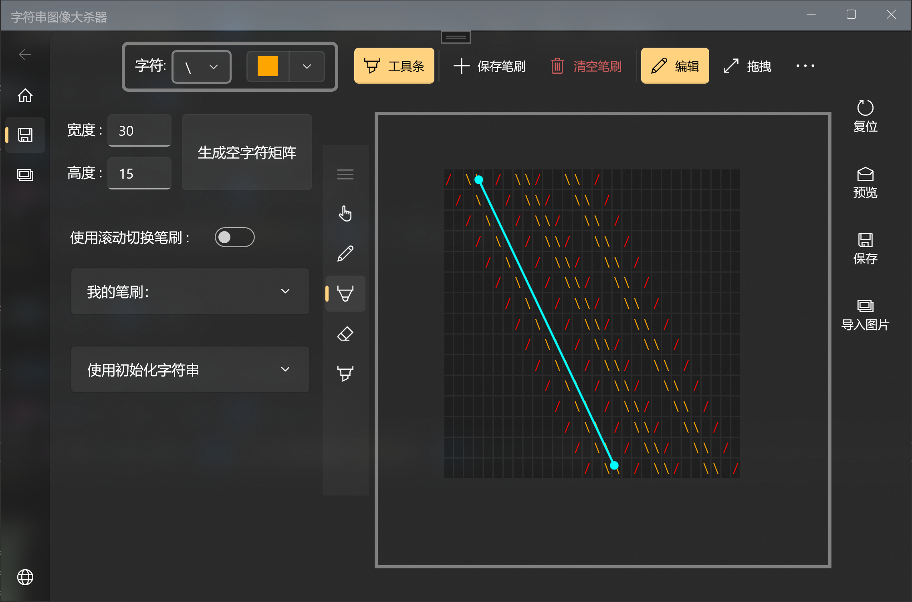

# 字符图像大杀器

一个提取图片特征像素点生成字符图像并进行编辑的APP

# Features

### 1. 图像特征像素点提取
- 将高分辨率图像转化为终端能完整显示的像素块矩阵
- 消除白色背景
- 生成像素矩阵颜色聚类，并使用终端支持颜色替换

### 2. 字符图像处理结果导出

- #### (1) 导出为c源代码
  - 使用Windows命令行API SetConsoleTextAttribute函数控制终端颜色
  - 在Windows命令行中显示彩色字符图像
- #### (2) 导出为Shell脚本
  - 使用Linux颜色字符转义控制终端输出文本颜色
  - 在Linux终端中显示彩色字符图像
- #### (3) 导出为纯文本

### 3. 字符图像编辑器
- #### (1) 画布初始化
  - 指定宽,高生成字符矩阵
  - 使用指定字符串进行初始化
- #### (2) 画布
  - 拖拽模式
    - 鼠标左键按下后可以对画布进行拖拽
    - 鼠标滚轮滚动对画布进行缩放
  - 编辑模式
    - 鼠标左键点击进行绘图操作
- #### (3) 工具条
  - 单点绘制
  - 拖拽绘制
  - 直线工具
  - 橡皮工具

